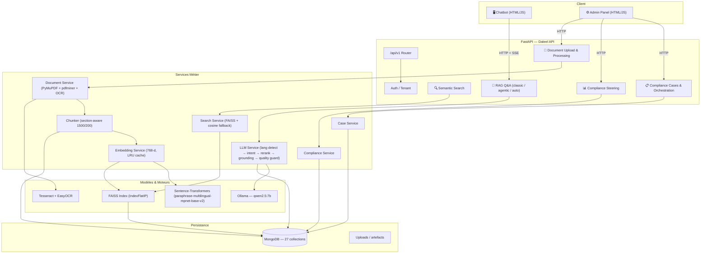

# 📜 Daleel — Plateforme RAG & Compliance Ops de Recherche Juridique Tunisienne

API intelligente pour l'upload, l'analyse, la recherche sémantique et le Q&A sur les documents juridiques tunisiens. Basée sur une architecture **RAG** (Retrieval-Augmented Generation) avec support **multilingue** (arabe, français, anglais), y compris les PDF scannés (OCR). Elle intègre aussi un module **Compliance Ops** (gestion de cas, orchestration, contrôles, preuves et exceptions).

---

## 🏗️ Architecture Technique

| Composant | Technologie |
|-----------|-------------|
| **API** | FastAPI + Uvicorn |
| **Base de données** | MongoDB (Motor async) |
| **Embeddings** | `sentence-transformers/paraphrase-multilingual-mpnet-base-v2` (768d) — **fine-tuné domaine juridique tunisien** |
| **LLM** | Ollama — `qwen2.5:7b` |
| **Vector Search** | FAISS (IndexFlatIP, in-memory) + fallback Python cosine |
| **Auth** | API Key (`X-API-Key`) + Multi-tenant optionnel (`X-Org-Id`) |
| **OCR** | Tesseract + EasyOCR (fallback) |
| **PDF** | PyMuPDF + pdfminer.six |
| **Frontend** | Interface chatbot + panneau admin (HTML/CSS/JS) |

### 🗺️ Diagramme d'Architecture



---

## ✨ Modules Clés

- **RAG juridique** : ingestion, chunking, recherche sémantique, Q&A multilingue.
- **Case Management** : dossiers de conformité, messages, documents, findings, actions.
- **Case Conversation** : création de cas depuis une situation et échanges guidés.
- **Orchestration & Advisor** : analyse d'un cas, propositions de remédiation, reponse structurée.
- **Compliance Steering** : assessments, controls, evidences, mapping exigences ↔ contrôles, exceptions.

## ⚡ Démarrage Rapide

### 1. Installer les dépendances

```bash
# Créer l'environnement virtuel
python -m venv .venv

# Activer
# Windows :
.venv\Scripts\activate
# Linux/Mac :
source .venv/bin/activate

# Installer les packages
pip install -r requirements.txt
```

### 2. Prérequis externes

- **MongoDB** : `mongod` doit tourner sur `localhost:27017`
- **Ollama** : installer [Ollama](https://ollama.ai) puis `ollama pull qwen2.5:7b`
- **Tesseract** *(optionnel, pour l'OCR)* : installer Tesseract 5.x avec les langues `ara`, `fra`, `eng`
- **FAISS** *(optionnel, recommandé)* : `pip install faiss-cpu` pour accélérer la recherche vectorielle (sinon fallback Python cosine)

### 3. Configurer l'environnement

Copier `.env.example` vers `.env` et adapter si besoin :

```bash
cp .env.example .env
```

### 4. Lancer le serveur

```bash
uvicorn app.main:app --reload
```

L'API sera disponible sur `http://localhost:8000`.
- Documentation interactive : `http://localhost:8000/docs`
- Interface chatbot : `http://localhost:8000/`
- Panneau admin : `http://localhost:8000/admin`

---

## 📡 API Reference

**Base URL :** `http://localhost:8000/api/v1`  
**Docs interactives :** `http://localhost:8000/docs` (liste complète des routes)

### Core — Documents & RAG

| Méthode | Endpoint | Description |
|---------|----------|-------------|
| `POST` | `/documents/upload` | Uploader un document (PDF, DOCX, TXT, image) |
| `POST` | `/documents/bulk-upload` | Upload en masse depuis un répertoire local |
| `GET` | `/documents` | Lister tous les documents |
| `GET` | `/documents/{id}` | Détails d'un document |
| `GET` | `/documents/{id}/source` | Infos sur le fichier source |
| `GET` | `/documents/{id}/chunks` | Chunks extraits d'un document |
| `GET` | `/documents/{id}/raw-pages` | Pages brutes (texte extrait) |
| `GET` | `/documents/{id}/cleaned-pages` | Pages nettoyées |
| `GET` | `/documents/{id}/exigences` | Lister les exigences d'un document |
| `POST` | `/documents/{id}/extract-exigences` | Extraire les exigences (manuel) |
| `DELETE` | `/documents/{id}` | Supprimer un document |
| `POST` | `/search` | Recherche sémantique vectorielle |
| `POST` | `/ask` | Q&A classique (RAG + LLM) |
| `POST` | `/ask-agentic` | Q&A agentique (boucle de retrieval) |
| `POST` | `/ask-auto` | Q&A avec sélection automatique du mode |
| `POST` | `/ask-stream` | Q&A streaming SSE |
| `POST` | `/feedback` | Feedback utilisateur (corrections) |
| `GET` | `/feedback` | Lister les feedbacks |

### Profils d'Entreprise & Applicabilité

| Méthode | Endpoint | Description |
|---------|----------|-------------|
| `POST` | `/company-profiles` | Créer un profil d'entreprise |
| `GET` | `/company-profiles` | Lister les profils |
| `GET` | `/company-profiles/{id}` | Détails d'un profil |
| `PUT` | `/company-profiles/{id}` | Mettre à jour un profil |
| `DELETE` | `/company-profiles/{id}` | Supprimer un profil |
| `POST` | `/company-profiles/{id}/evaluate-applicabilities` | Évaluer l'applicabilité des exigences |
| `GET` | `/company-profiles/{id}/applicabilities` | Lister les applicabilités |
| `GET` | `/company-profiles/{id}/applicabilities/summary` | Résumé des applicabilités |

### Lois, Articles & Versioning

| Méthode | Endpoint | Description |
|---------|----------|-------------|
| `POST` | `/lois` | Créer une loi |
| `GET` | `/lois` | Lister les lois |
| `GET` | `/lois/{id}` | Détails d'une loi |
| `PATCH` | `/lois/{id}` | Mettre à jour une loi |
| `DELETE` | `/lois/{id}` | Supprimer une loi |
| `POST` | `/lois/{id}/segment-document` | Segmenter un document en articles |
| `GET` | `/lois/{id}/articles` | Lister les articles d'une loi |
| `GET` | `/articles/{id}` | Détails d'un article |
| `GET` | `/articles/{id}/versions` | Versions d'un article |
| `GET` | `/article-versions/{id}` | Détails d'une version |
| `GET` | `/article-versions/{id}/exigences` | Exigences d'une version |
| `POST` | `/article-versions/{id}/extract-actions` | Extraire les actions |
| `GET` | `/article-versions/{id}/actions` | Lister les actions |

### Criticité, Dépendances & Feuille de Route

| Méthode | Endpoint | Description |
|---------|----------|-------------|
| `POST` | `/lois/{id}/compute-criticality` | Calculer la criticité d'une loi |
| `POST` | `/article-versions/{id}/compute-criticality` | Criticité d'une version |
| `GET` | `/actions/{id}/criticality` | Criticité d'une action |
| `POST` | `/action-dependencies` | Créer une dépendance entre actions |
| `GET` | `/actions/{id}/dependencies` | Dépendances d'une action |
| `GET` | `/company-profiles/{id}/roadmap` | Feuille de route de conformité |
| `POST` | `/company-profiles/{id}/roadmap/refresh` | Recalculer la feuille de route |

### Amendements & Audit

| Méthode | Endpoint | Description |
|---------|----------|-------------|
| `PATCH` | `/documents/{id}/classify` | Classifier un document (loi principale / modificatif) |
| `POST` | `/documents/{id}/extract-amendments` | Extraire les opérations d'amendement |
| `GET` | `/documents/{id}/amendments` | Lister les opérations d'amendement |
| `POST` | `/amendment-operations/{id}/apply` | Appliquer un amendement |
| `POST` | `/documents/{id}/apply-amendments` | Appliquer tous les amendements |
| `GET` | `/audit-logs` | Journal d'audit |
| `GET` | `/lois/{id}/audit-logs` | Audit d'une loi |
| `GET` | `/articles/{id}/audit-logs` | Audit d'un article |
| `POST` | `/lois/{id}/recalculate` | Recalculer exigences/actions/criticité |
| `POST` | `/lois/{id}/recalculate-versions` | Recalcul ciblé par versions |

### Admin & Exports

| Méthode | Endpoint | Description |
|---------|----------|-------------|
| `GET` | `/admin/stats` | Statistiques globales |
| `GET` | `/admin/vector-stats` | Métriques index vectoriel |
| `POST` | `/admin/create-vector-index` | (Re)créer l'index vectoriel |
| `GET` | `/admin/analytics` | Analytics (Q&A, couverture, etc.) |
| `GET` | `/admin/notifications` | Notifications d'impact |
| `POST` | `/company-profiles/{id}/roadmap/export` | Export Excel/CSV |

### Compliance Cases (Case Management)

| Méthode | Endpoint | Description |
|---------|----------|-------------|
| `POST` | `/cases` | Créer un cas |
| `GET` | `/cases` | Lister les cas |
| `GET` | `/cases/summary` | Stats globales des cas |
| `GET` | `/cases/{id}` | Détails d'un cas |
| `PATCH` | `/cases/{id}` | Mettre à jour un cas |
| `DELETE` | `/cases/{id}` | Supprimer un cas |
| `POST` | `/cases/{id}/messages` | Ajouter un message |
| `GET` | `/cases/{id}/messages` | Lister les messages |
| `POST` | `/cases/{id}/documents` | Attacher un document existant |
| `POST` | `/cases/{id}/documents/upload` | Upload + attacher + analyser |
| `GET` | `/cases/{id}/documents` | Lister les documents du cas |
| `POST` | `/cases/{id}/documents/{case_document_id}/analyze` | Analyser un document du cas |
| `POST` | `/cases/{id}/findings` | Créer un finding |
| `GET` | `/cases/{id}/findings` | Lister les findings |
| `POST` | `/cases/{id}/actions` | Créer une action |
| `GET` | `/cases/{id}/actions` | Lister les actions |

### Case Conversation & Orchestration

| Méthode | Endpoint | Description |
|---------|----------|-------------|
| `POST` | `/cases/from-conversation` | Créer un cas depuis une situation |
| `POST` | `/cases/{id}/converse` | Continuer la conversation |
| `GET` | `/cases/{id}/summary` | Résumé conversationnel |
| `POST` | `/cases/{id}/orchestrate` | Orchestration (analyse) |
| `GET` | `/cases/{id}/orchestrate/status` | Statut de préparation |
| `GET` | `/cases/{id}/orchestrate/assess` | Évaluation rapide |
| `GET` | `/cases/{id}/orchestrate/questions` | Questions suggérées |
| `POST` | `/cases/{id}/orchestrate/advise` | reponse conseiller structurée |

### Compliance Steering (prefix `/compliance`)

| Méthode | Endpoint | Description |
|---------|----------|-------------|
| `POST` | `/compliance/assessments` | Créer un assessment |
| `GET` | `/compliance/assessments` | Lister les assessments |
| `PATCH` | `/compliance/assessments/{id}` | Mettre à jour un assessment |
| `GET` | `/compliance/assessments/{id}/posture` | Posture par assessment |
| `POST` | `/compliance/controls` | Créer un contrôle |
| `GET` | `/compliance/controls` | Lister les contrôles |
| `POST` | `/compliance/controls/{id}/evidences` | Ajouter une preuve |
| `GET` | `/compliance/controls/{id}/evidences` | Lister les preuves |
| `POST` | `/compliance/links` | Lier exigence ↔ contrôle |
| `GET` | `/compliance/links` | Lister les liens |
| `GET` | `/compliance/posture/{company_profile_id}` | Posture globale |
| `GET` | `/compliance/gaps/{company_profile_id}` | Gaps de conformité |
| `POST` | `/compliance/exceptions` | Enregistrer une exception |
| `GET` | `/compliance/exceptions` | Lister les exceptions |
| `POST` | `/compliance/remediation-actions` | Actions de remédiation |

> **Note** : les endpoints `/ask`, `/ask-auto`, `/ask-agentic` exploitent automatiquement le domain router, le retrieval partitionné, le quality guard et le KG light selon les flags de configuration.

---

## 🧪 Pipeline de Traitement Documentaire

```
PDF / DOCX / Image
    ↓
[Extraction 3 tiers] — PyMuPDF → pdfminer.six → OCR (Tesseract / EasyOCR)
    ↓
[Nettoyage] — arabic-reshaper, python-bidi, normalisation Unicode
    ↓
[Chunking] — fenêtre glissante section-aware (1500 chars / 200 overlap)
    ↓
[Embedding] — `paraphrase-multilingual-mpnet-base-v2` fine-tuné (768d)
    ↓
[Stockage] — MongoDB (collection `chunks`) + FAISS index (rebuild au boot)
```

## 🧠 Pipeline RAG (Q&A)

```
Question utilisateur
    ↓
Détection langue (ar/fr/en) + Classification intent
    ↓
Domain Router → data_protection | labor | corporate | investment | cross_domain
    ↓
Retrieval partitionné (base law + amendments, ratio selon intent)
    ↓
Hybrid Reranking (cosine + BM25 lexical + anchor overlap + article ref)
    ↓
KG Light enrichment (sous-graphe Loi→Article→Exigence→Action)
    ↓
LLM Generation (Ollama qwen2.5:7b) + Feedback few-shot
    ↓
Quality Guard (validation refs, fidélité sémantique, langue)
    ↓
reponse + Sources + Métadonnées
```

## 🧪 Workflow de Test

```
Étape 1 → Upload :        POST /api/v1/documents/upload       (uploader un PDF)
Étape 2 → Lister :        GET  /api/v1/documents               (confirmer la présence)
Étape 3 → Chunks :        GET  /api/v1/documents/{id}/chunks   (vérifier le traitement)
Étape 4 → Recherche :     POST /api/v1/search                  (recherche vectorielle)
Étape 5 → Question :      POST /api/v1/ask                     (Q&A avec LLM) ⭐
Étape 6 → Supprimer :     DELETE /api/v1/documents/{id}        (nettoyage)
```

---

## 🔐 Authentification & Multi-tenant

- **API Key** : `X-API-Key` header via `DALEEL_API_KEY`. Désactivée si vide (mode dev).
- **Admin Key** : `X-API-Key` pour `/admin/*` via `DALEEL_ADMIN_API_KEY` (fallback sur `DALEEL_API_KEY`).
- **Multi-tenant** : `DALEEL_MULTI_TENANT_ENABLED=true` exige le header `X-Org-Id` pour l'isolation des données.

## 📝 Format des Erreurs

```json
{
  "detail": "Message d'erreur"
}
```

| Code | Signification |
|------|---------------|
| `400` | Requête invalide |
| `401` | Authentification requise (API key manquante) |
| `403` | Clé API invalide |
| `404` | Ressource non trouvée |
| `413` | Fichier trop volumineux (> 100 Mo) |
| `422` | Erreur de validation ou de traitement |

---

## 📁 Structure du Projet

```
Daleel/
├── .env.example                # Template des variables d'environnement
├── requirements.txt            # Dépendances Python
├── .github/workflows/ci.yml    # CI GitHub Actions (Ruff + pytest)
├── data/                       # Documents juridiques pour le bulk upload
├── uploads/                    # Fichiers uploadés (runtime)
├── processed/                  # Résultats traités (runtime)
├── app/
│   ├── main.py                 # Point d'entrée FastAPI + lifespan (DB + FAISS)
│   ├── config.py               # Configuration Pydantic (~30 paramètres env)
│   ├── database.py             # Client MongoDB, indexes, seeds lois
│   ├── schemas.py              # 40+ modèles Pydantic (request/response)
│   ├── api/
│   │   ├── router.py           # 66 endpoints FastAPI
│   │   ├── auth.py             # Auth API Key (constant-time compare)
│   │   ├── tenant.py           # Multi-tenant middleware (X-Org-Id)
│   │   ├── case_router.py       # Case management (Sprint 7)
│   │   ├── case_conversation_router.py  # Case conversation workflow
│   │   ├── case_orchestrator_router.py  # Case orchestration + advisor
│   │   └── compliance_router.py # Compliance steering module
│   ├── services/
│   │   ├── document_service.py      # Upload, traitement, chunking
│   │   ├── embedding_service.py     # Texte → vecteurs d'embeddings (cache LRU)
│   │   ├── search_service.py        # Recherche par similarité vectorielle
│   │   ├── faiss_index.py           # Index FAISS in-memory (rebuild au boot)
│   │   ├── llm_service.py           # Pipeline RAG + LLM (2655 lignes)
│   │   ├── feedback_service.py      # Gestion du feedback utilisateur
│   │   ├── loi_service.py           # Gestion des lois et segmentation
│   │   ├── action_service.py        # Extraction des actions réglementaires
│   │   ├── applicability_service.py # Évaluation d'applicabilité
│   │   ├── criticality_service.py   # Calcul de criticité
│   │   ├── roadmap_service.py       # Feuille de route de conformité
│   │   ├── amendment_service.py     # Gestion des amendements
│   │   ├── audit_service.py         # Journal d'audit
│   │   ├── recalculation_service.py  # Recalcul des dépendances
│   │   ├── domain_router.py         # Routage domaine juridique (Sprint 6)
│   │   ├── legal_retrieval_orchestrator.py  # Retrieval partitionné base/amendements
│   │   ├── quality_guard_service.py # Anti-hallucination post-génération
│   │   ├── graph_resolver.py        # KG Light (Loi→Article→Exigence→Action)
│   │   ├── analytics_service.py     # Stats admin
│   │   ├── export_service.py        # Export Excel/CSV
│   │   ├── notification_service.py  # Notifications
│   │   ├── case_service.py           # Gestion des cas
│   │   ├── case_document_service.py  # Documents liés aux cas + analyse
│   │   ├── case_conversation_service.py  # Workflow conversationnel
│   │   ├── compliance_case_orchestrator.py  # Orchestration des cas
│   │   ├── advisor_response_composer.py  # reponse conseiller
│   │   └── compliance_service.py      # Compliance steering
│   ├── processing/             # Extraction de texte & OCR
│   │   ├── extractor.py        # Extraction PDF/DOCX/images
│   │   ├── ocr.py              # Moteur OCR (Tesseract + EasyOCR)
│   │   ├── chunker.py          # Découpage en chunks
│   │   ├── legal_cleaner.py    # Nettoyage du texte juridique
│   │   ├── article_segmenter.py# Segmentation en articles
│   │   └── text_utils.py       # Utilitaires texte
│   ├── case_management/         # Analyse documentaire des cas
│   │   └── processing/          # OCR, extraction, utilitaires spécifiques
│   └── static/
│       ├── index.html          # Interface chatbot (dark theme)
│       └── admin.html          # Panneau d'administration
├── tests/                      # 18 fichiers de tests (~2185 lignes)
│   ├── test_api.py
│   ├── test_auth.py
│   ├── test_case_service.py
│   ├── test_case_document_service.py
│   ├── test_case_conversation_service.py
│   ├── test_compliance_case_orchestrator.py
│   ├── test_faiss_index.py
│   ├── test_domain_router.py
│   ├── test_legal_retrieval_orchestrator.py
│   ├── test_quality_guard_service.py
│   ├── test_graph_resolver.py
│   ├── test_llm_grounding_validation.py
│   ├── test_llm_retry.py
│   ├── test_integration_sprint6.py
│   └── benchmark_models.py
├── training/                   # Pipeline fine-tuning embeddings
│   ├── 01_build_eval_set.py         # Annotation eval set (25 Q)
│   ├── 02_build_train_set.py        # Génération paires d'entraînement
│   ├── 03_evaluate_retrieval.py     # Benchmark Recall@k, MRR@k, nDCG@k
│   ├── 04_finetune_embeddings.py    # Fine-tuning MNR Loss (PyTorch)
│   ├── data/                        # Datasets (articles, eval, train)
│   ├── models/                      # Modèle fine-tuné (~1.06 GB)
│   └── INTEGRATION.md               # Guide d'intégration du modèle
└── reset_and_rebuild.ps1       # Script de réinitialisation complète
```

---

## 🤖 Fine-Tuning du Modèle d'Embedding

Un pipeline complet de fine-tuning adapte le modèle `paraphrase-multilingual-mpnet-base-v2` au vocabulaire juridique tunisien.

| Étape | Script | Rôle |
|-------|--------|------|
| 1 | `training/01_build_eval_set.py` | Export articles + annotation eval set (25 queries gold) |
| 2 | `training/02_build_train_set.py` | Paires `(query, positive)` — feedback réel + synthétique LLM |
| 3 | `training/03_evaluate_retrieval.py` | Benchmark Recall@k, MRR@k, nDCG@k |
| 4 | `training/04_finetune_embeddings.py` | Fine-tuning PyTorch (MNR Loss, 2 epochs, batch 32) |

### Résultats du fine-tuning

| Métrique | Baseline | Fine-tuné | **Delta** |
|----------|----------|-----------|-----------|
| **recall@1** | 0.20 | **0.48** | **+140%** |
| **recall@5** | 0.32 | **0.56** | **+75%** |
| **mrr@10** | 0.25 | **0.52** | **+106%** |
| **ndcg@5** | 0.26 | **0.52** | **+101%** |
| **FR recall@5** | 0.53 | **0.87** | **+64%** |

> **Intégration** : changer `DALEEL_EMBEDDING_MODEL` dans `.env` vers `./training/models/daleel-embedding-finetuned` puis ré-encoder les chunks. Voir `training/INTEGRATION.md` pour la procédure complète (backup, ré-embedding, rollback).

## 🔧 Variables d'Environnement Clés

| Variable | Description | Défaut |
|----------|-------------|--------|
| `DALEEL_MONGODB_URL` | URI MongoDB | `mongodb://localhost:27017` |
| `DALEEL_LLM_MODEL` | Modèle Ollama | `qwen2.5:7b` |
| `DALEEL_EMBEDDING_MODEL` | Modèle embeddings | `sentence-transformers/paraphrase-multilingual-mpnet-base-v2` |
| `DALEEL_VECTOR_SEARCH_BACKEND` | `faiss` ou `python-cosine` | `faiss` |
| `DALEEL_API_KEY` | Clé API (vide = désactivé) | *(vide)* |
| `DALEEL_QUALITY_GUARD_ENABLED` | Anti-hallucination | `true` |
| `DALEEL_DOMAIN_ROUTER_ENABLED` | Routage domaine juridique | `true` |
| `DALEEL_KG_LIGHT_ENABLED` | Enrichissement graphe | `true` |
| `DALEEL_PARTITIONED_RETRIEVAL_ENABLED` | Retrieval base/amendements | `true` |

## 🔄 CI/CD

GitHub Actions exécute à chaque push :
- **Lint** : Ruff (`app/`, `tests/`)
- **Tests** : pytest sur Python 3.11 / 3.12 / 3.13 avec MongoDB 7 en service container

## 📜 Licence

Ce projet a été réalisé dans le cadre d'un Projet de Fin d'Études (PFE).
