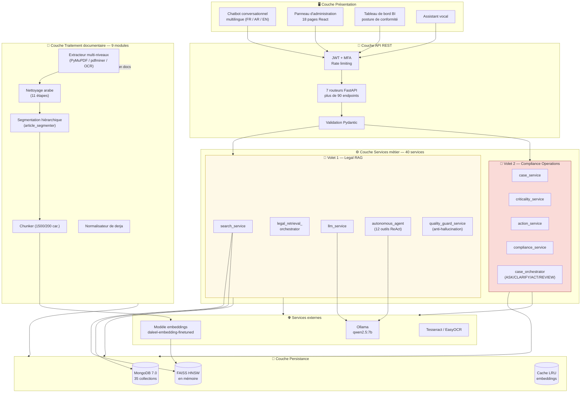
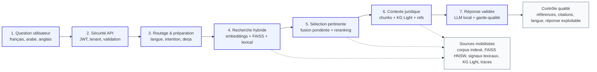
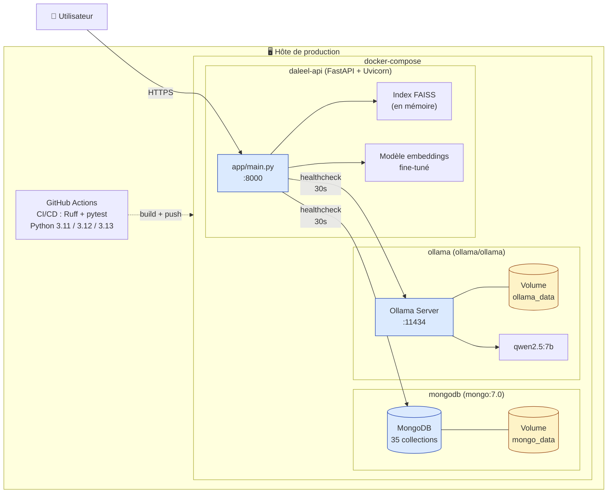

# Schéma d'architecture globale — Daleel

## Vue en couches et flux end-to-end

```mermaid
flowchart TB
    subgraph Pres["🖥️ Couche Présentation"]
        UI_Chat["Chatbot conversationnel<br/>multilingue (FR / AR / EN)"]
        UI_Admin["Panneau d'administration<br/>18 pages React"]
        UI_BI["Tableau de bord BI<br/>posture de conformité"]
        UI_Voice["Assistant vocal"]
    end

    subgraph API["🔌 Couche API REST"]
        Auth["JWT + MFA<br/>Rate limiting"]
        Router["7 routeurs FastAPI<br/>plus de 90 endpoints"]
        Pydantic["Validation Pydantic"]
    end

    subgraph Volets["⚙️ Couche Services métier — 40 services"]
        direction LR
        subgraph V1["📘 Volet 1 — Legal RAG"]
            Search["search_service"]
            Orch["legal_retrieval_<br/>orchestrator"]
            LLM["llm_service"]
            Agent["autonomous_agent<br/>(12 outils ReAct)"]
            QG["quality_guard_service<br/>(anti-hallucination)"]
        end
        subgraph V2["📕 Volet 2 — Compliance Operations"]
            Case["case_service"]
            Crit["criticality_service"]
            Action["action_service"]
            Comp["compliance_service"]
            Orchcomp["case_orchestrator<br/>(ASK/CLARIFY/ACT/REVIEW)"]
        end
    end

    subgraph Proc["📄 Couche Traitement documentaire — 9 modules"]
        Extract["Extracteur multi-niveaux<br/>(PyMuPDF / pdfminer / OCR)"]
        Clean["Nettoyage arabe<br/>(11 étapes)"]
        Segment["Segmentation hiérarchique<br/>(article_segmenter)"]
        Chunk["Chunker (1500/200 car.)"]
        Derja["Normalisateur de derja"]
    end

    subgraph Pers["💾 Couche Persistance"]
        Mongo[("MongoDB 7.0<br/>35 collections")]
        Faiss[("FAISS HNSW<br/>en mémoire")]
        Cache[("Cache LRU<br/>embeddings")]
    end

    subgraph Ext["🌐 Services externes"]
        Ollama["Ollama<br/>qwen2.5:7b"]
        Embed["Modèle embeddings<br/>daleel-embedding-finetuned"]
        OCRext["Tesseract / EasyOCR"]
    end

    UI_Chat --> Auth
    UI_Admin --> Auth
    UI_BI --> Auth
    UI_Voice --> Auth
    Auth --> Router
    Router --> Pydantic
    Pydantic --> V1
    Pydantic --> V2

    V1 --> Pers
    V2 --> Pers
    V1 --> Ext
    V2 --> Ext

    Proc --> Pers
    Proc -.->|ingestion docs| Extract
    Extract --> Clean --> Segment --> Chunk
    Chunk --> Embed
    Embed --> Faiss

    Agent --> Ollama
    LLM --> Ollama
    Search --> Faiss
    Search --> Mongo

    classDef coucheStyle fill:#e8f4f8,stroke:#2c3e50,stroke-width:2px
    classDef voletRAG fill:#fef9e7,stroke:#b7950b
    classDef voletComp fill:#fadbd8,stroke:#922b21
    class V1 voletRAG
    class V2 voletComp
```

---

## Traitement d'une requête utilisateur dans le pipeline RAG

```mermaid
flowchart LR
    U["1. Question utilisateur<br/>français, arabe, anglais"]
    API["2. Sécurité API<br/>JWT, tenant, validation"]
    R["3. Routage & préparation<br/>langue, intention, derja"]
    H["4. Recherche hybride<br/>embeddings + FAISS + lexical"]
    S["5. Sélection pertinente<br/>fusion pondérée + reranking"]
    C["6. Contexte juridique<br/>chunks + KG Light + refs"]
    G["7. Réponse validée<br/>LLM local + garde-qualité"]

    U --> API --> R --> H --> S --> C --> G

    Sources["Sources mobilisées<br/>corpus indexé, FAISS HNSW, signaux lexicaux, KG Light, traces"]
    QG["Contrôle qualité<br/>références, citations, langue, réponse exploitable"]

    H -.-> Sources
    S -.-> Sources
    C -.-> Sources
    G --> QG

    classDef phase fill:#eef4ff,stroke:#4f46e5,stroke-width:2px
    classDef data fill:#f8fafc,stroke:#98a2b3,stroke-width:2px
    class U,API,R,H,S,C,G phase
    class Sources,QG data
```

---

## Schéma de déploiement Docker Compose

```mermaid
flowchart LR
    subgraph Host["🖥️ Hôte de production"]
        subgraph DC["docker-compose"]
            subgraph S1["mongodb (mongo:7.0)"]
                M[("MongoDB<br/>35 collections")]
                MV[(Volume<br/>mongo_data)]
                M --- MV
            end
            subgraph S2["ollama (ollama/ollama)"]
                O["Ollama Server<br/>:11434"]
                OV[(Volume<br/>ollama_data)]
                Q["qwen2.5:7b"]
                O --- OV
                O --> Q
            end
            subgraph S3["daleel-api (FastAPI + Uvicorn)"]
                A["app/main.py<br/>:8000"]
                F["Index FAISS<br/>(en mémoire)"]
                EM["Modèle embeddings<br/>fine-tuné"]
                A --> F
                A --> EM
            end
            A -->|"healthcheck<br/>30s"| M
            A -->|"healthcheck<br/>30s"| O
        end
        CI["GitHub Actions<br/>CI/CD : Ruff + pytest<br/>Python 3.11 / 3.12 / 3.13"]
        CI -.->|"build + push"| DC
    end

    User["👤 Utilisateur"] -->|"HTTPS"| A

    classDef svc fill:#dbeafe,stroke:#1e40af
    classDef vol fill:#fef3c7,stroke:#92400e
    class M,O,A svc
    class MV,OV vol
```
