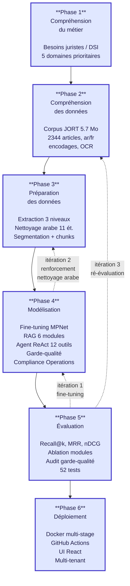
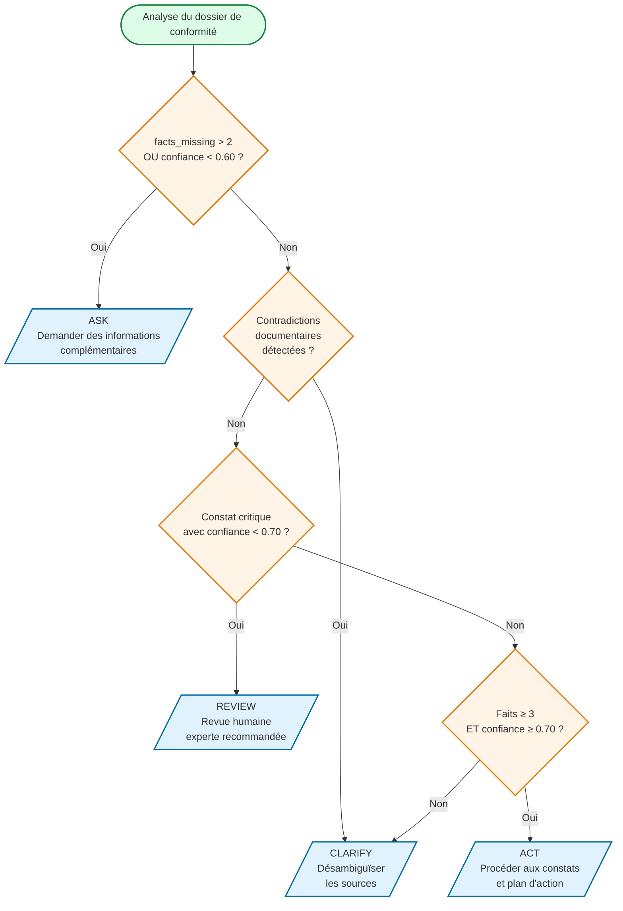
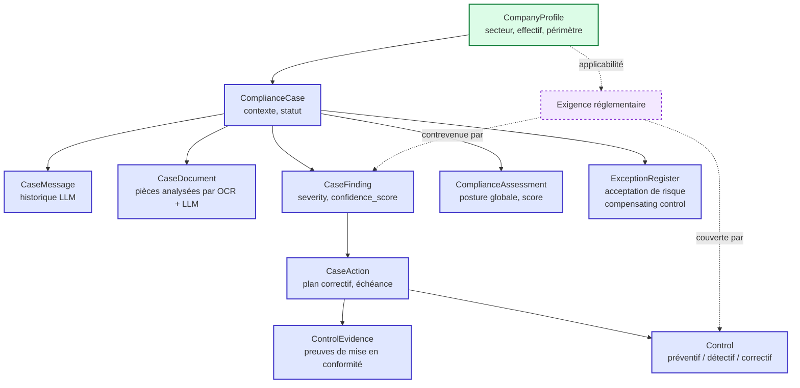
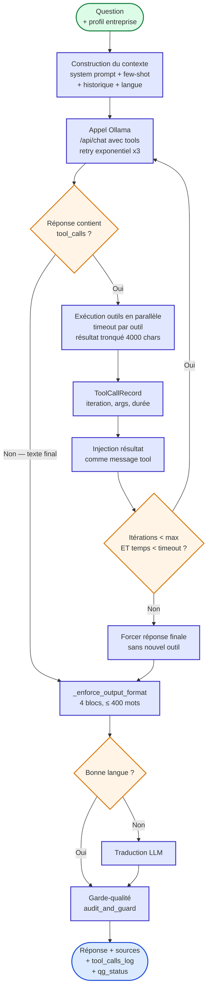

# Figures pour le rapport Daleel — sources Mermaid

> **Usage** : copier chaque bloc dans https://mermaid.live → exporter en PNG ou SVG → insérer dans le rapport à la place du diagramme ASCII.
> En local : extension VS Code "Markdown Preview Mermaid Support" affiche le rendu directement.

---

## Figure 1.1 — Cycle CRISP-DM appliqué à Daleel

À insérer dans la section **1.6.1.1** (remplace le schéma ASCII actuel).



> Les flèches pointillées rouges illustrent les itérations effectives du projet — caractéristiques fondamentales de la méthodologie CRISP-DM, qui n'est pas un cycle linéaire en cascade.

---

## Figure 2.1 — Arbre de décision ASK / CLARIFY / ACT / REVIEW

À insérer dans la section **2.8.3** du rapport (remplace le schéma ASCII).



---

## Figure 2.2 — Modèle conceptuel de la hiérarchie juridique

À insérer dans la section **2.9.1**.

```mermaid
flowchart LR
    Loi[Loi<br/>code, titre, date] --> Article[Article<br/>article_key, numéro]
    Article --> Version[ArticleVersion<br/>version_number<br/>is_current, is_base_version]
    Version --> Amendment[AmendmentOperation<br/>type: additive | substitutive<br/>modificative | abrogative]
    Amendment -.modifie.-> Version

    Version --> Exigence[Exigence<br/>type: obligation, sanction,<br/>condition, interdiction]
    Exigence --> Action[Action<br/>modalité, texte, contexte]
    Action --> Criticality[ActionCriticality<br/>level: critique / importante<br/>/ secondaire<br/>score, reasons]
    Action --> Dependency[ActionDependency<br/>depends_on_action_id]

    classDef ent fill:#e0e7ff,stroke:#4338ca,stroke-width:2px;
    classDef rel fill:#fef3c7,stroke:#d97706,stroke-width:1.5px,stroke-dasharray: 5 5;
    class Loi,Article,Version,Exigence,Action,Criticality ent;
    class Amendment,Dependency rel;
```

---

## Figure 2.3 — Modèle conceptuel du cycle de conformité

À insérer dans la section **2.9.2**.



---

## Figure bonus — Architecture globale en 5 couches × 2 volets (Fig 2.1 du rapport)

À insérer dans la section **2.2.2** (remplace le tableau seul par un schéma visuel + tableau).

```mermaid
flowchart TB
    subgraph Présentation
        UI1[Chatbot Chat.jsx]
        UI2[Admin Panel<br/>12 pages]
        UI3[Dashboard BI]
        UI4[Assistant vocal]
    end

    subgraph API_REST["API REST — FastAPI"]
        R1[router.py<br/>Legal RAG]
        R2[case_router<br/>Compliance]
        R3[auth_router<br/>JWT + MFA]
        R4[case_orchestrator_router]
    end

    subgraph Services["Services métier — 40 modules"]
        direction LR
        SR1["**Volet Legal RAG**<br/>search_service<br/>legal_retrieval_orchestrator<br/>autonomous_agent<br/>reranker, quality_guard<br/>embedding_service, llm_service"]
        SR2["**Volet Compliance Operations**<br/>compliance_case_orchestrator<br/>criticality_service, action_service<br/>applicability_service, roadmap_service<br/>case_service, audit_service"]
    end

    subgraph Processing["Traitement documentaire"]
        P1[Extractor 3 niveaux]
        P2[Nettoyage arabe 11 étapes]
        P3[Article segmenter]
        P4[Chunker]
        P5[Derja normalizer]
    end

    subgraph Persistance["Persistance"]
        DB[(MongoDB 7.0<br/>35 collections)]
        FAISS[(FAISS HNSW<br/>en mémoire<br/>M=32, efC=200)]
        CACHE[(Cache LRU<br/>embeddings 512<br/>+ LLM cache)]
    end

    Présentation --> API_REST
    API_REST --> Services
    Services --> Processing
    Services --> Persistance
    Processing --> Persistance

    classDef ui fill:#dbeafe,stroke:#1d4ed8;
    classDef api fill:#fef3c7,stroke:#d97706;
    classDef svc fill:#e0e7ff,stroke:#4338ca;
    classDef proc fill:#fce7f3,stroke:#be185d;
    classDef pers fill:#dcfce7,stroke:#15803d;

    class UI1,UI2,UI3,UI4 ui;
    class R1,R2,R3,R4 api;
    class SR1,SR2 svc;
    class P1,P2,P3,P4,P5 proc;
    class DB,FAISS,CACHE pers;
```



---

## Figure bonus — Pipeline RAG à 6 modules (flux d'une requête)

À insérer dans la section **2.4** (intro du pipeline).

```mermaid
flowchart LR
    Q[Question<br/>utilisateur] --> Norm[Détection langue<br/>+ derja normalizer]
    Norm --> Emb[Encodage<br/>768d MPNet finetuné<br/>cache LRU]

    Emb --> M1["Module 1<br/>Recherche hybride<br/>FAISS ∥ BM25<br/>RRF k=60"]
    M1 --> M2["Module 2<br/>Cross-encoder<br/>ms-marco-MiniLM-L-6-v2<br/>seuil -2.0"]
    M2 --> M3["Module 3<br/>Routeur de domaine<br/>5 domaines + fallback LLM"]
    M3 --> M4["Module 4<br/>Retrieval partitionné<br/>base vs amendement<br/>piloté par intention"]
    M4 --> M5["Module 5<br/>KG Light<br/>Loi → Article → Exigence<br/>→ Action → Criticité"]
    M5 --> LLM[qwen2.5:7b<br/>via Ollama<br/>T=0.15, top_p=0.9]
    LLM --> M6["Module 6<br/>Garde-qualité<br/>références + citations<br/>fenêtre glissante 4-8 mots"]
    M6 --> R[Réponse<br/>+ sources<br/>+ qg_status]

    classDef io fill:#dbeafe,stroke:#1d4ed8,stroke-width:2px;
    classDef mod fill:#e0e7ff,stroke:#4338ca,stroke-width:2px;
    classDef ext fill:#fef3c7,stroke:#d97706,stroke-width:2px;

    class Q,R io;
    class Norm,Emb,M1,M2,M3,M4,M5,M6 mod;
    class LLM ext;
```



---

## Figure bonus — Boucle ReAct de l'agent autonome

À insérer dans la section **2.5.1** ou **3.5.2**.



---

## Comment intégrer les figures dans Pandoc/PDF

Une fois les PNG/SVG exportés depuis mermaid.live, placer dans `figures/` à la racine et remplacer dans le rapport :

```markdown
**Figure 2.1 — Arbre de décision de l'orchestrateur Compliance Operations.**


```

Pour Word/LibreOffice, importer les SVG directement (rendu vectoriel net à l'impression).
